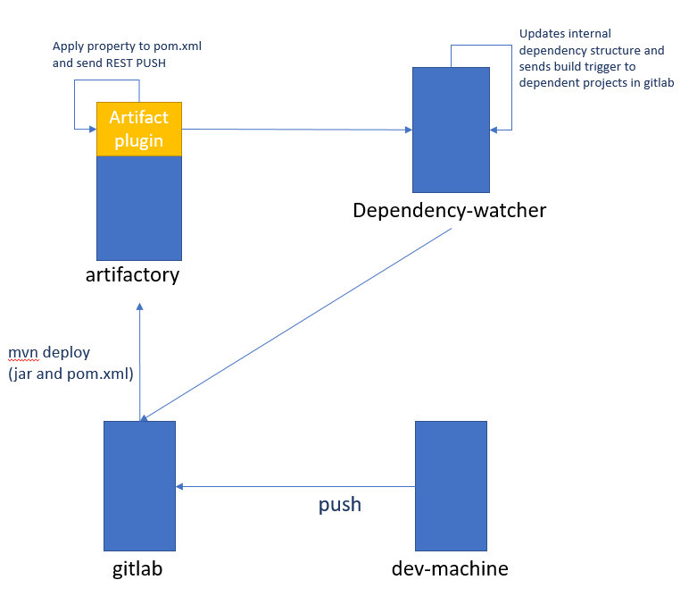

# Dependency Watcher
======

## Motivation
Gitlab doesn't have any way to trigger the build of a project when any of it's dependencies gets built. This project tries to address this need

## Architecture

When a project in gitlab gets compiled, the last step is deploy the artifact to artifactory. 
We are creating a plugin on it so it will send a REST POST request to this server with the pom file every time that a project is built. 
Then, this server will maintain a "Internal database" and based on that information will send a trigger to git lab to all the projects that have dependencies on the just built project.

## Details

### Single REST entry point
There is only one REST exposed of this server that is used by Artifactory to notify that a project just got compiled. 
Then from there two things happens. First, the server updates it's dependency tree and then triggers any project that depends on it.

### At start time
At start time, the server will ask to (IPomRetriever) to give all the poms files of a given repository to build a internal structure. The current implementation of that interface is retrieving 
those poms files from Artifactory

 
